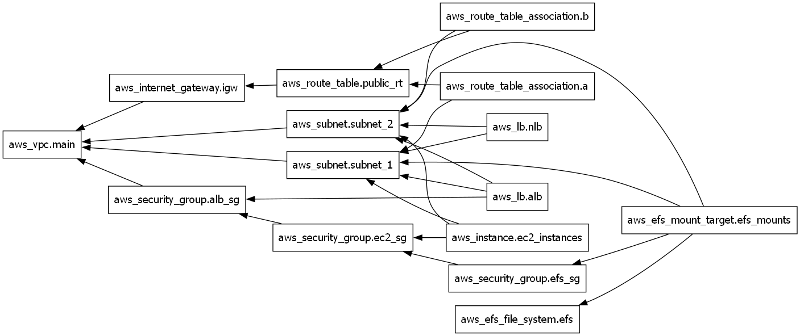

## 🛠️ What It Includes

- **VPC** with public subnets
- **EC2 instances**
- **Elastic File System (EFS)** and mount targets
- **Application Load Balancer (ALB)** and Network Load Balancer (NLB)
- **Internet Gateway & Route Tables**
- **Security Groups** for ALB, EC2, and EFS

## 📷 Infrastructure Graph

A visual representation of the resource relationships is available in `graph.png`:


## 🚀 Getting Started

### Prerequisites
- [Terraform](https://www.terraform.io/downloads.html)
- An AWS account
- Configured AWS CLI or credentials file

### Usage

```bash
# Initialize Terraform
terraform init

# Review the plan
terraform plan

# Apply the configuration
terraform apply

# Destroy configuration
terraform destroy
